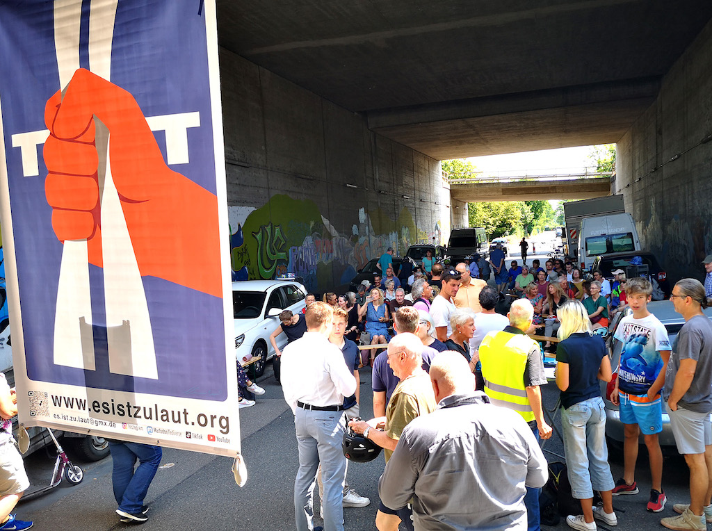
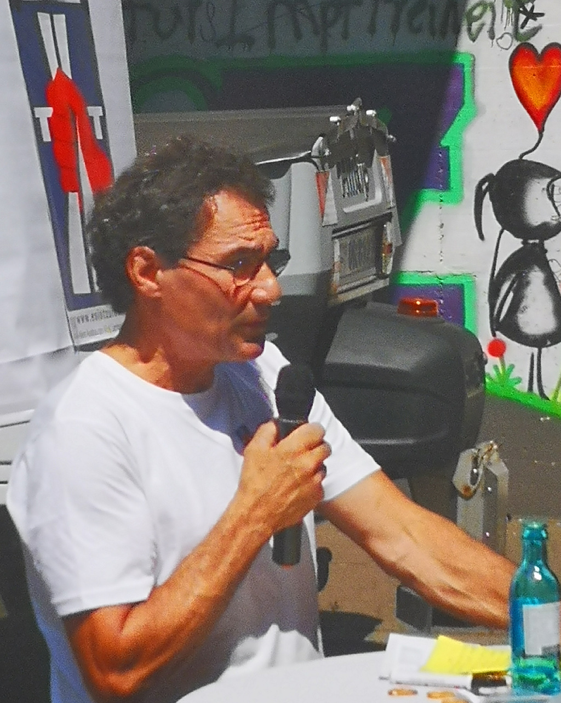
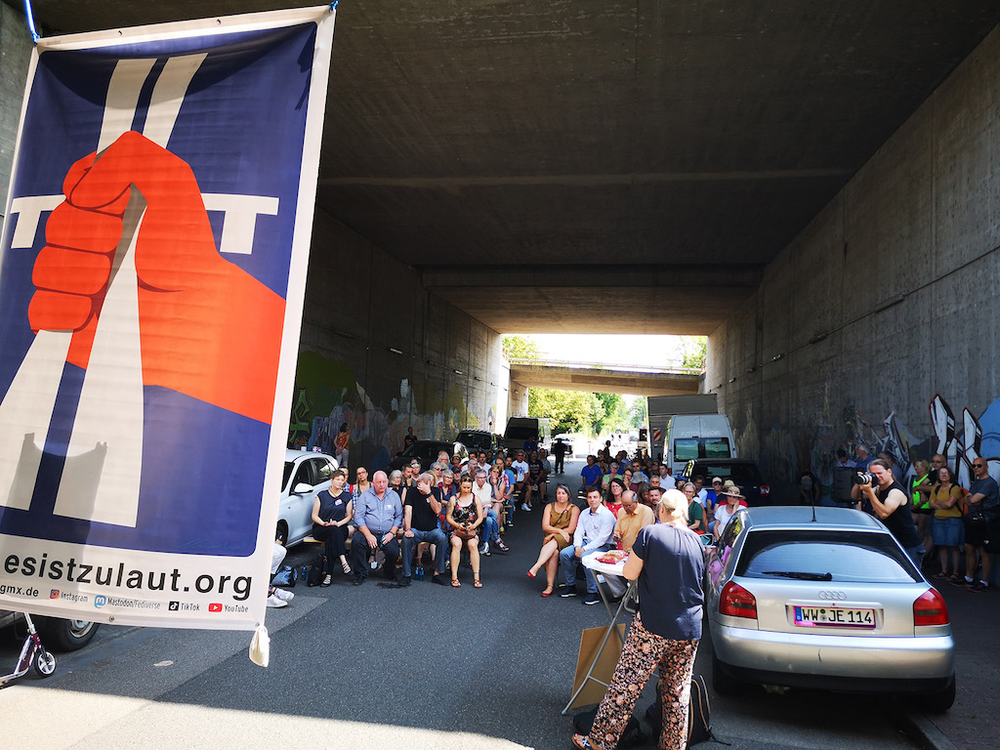

## Im Schatten der Autobahn

Erfolgreiche Veranstaltung der BI gegen den Ausbau der A5 und intensive Diskussionen mit Politiker:innen aus Frankfurt und Hessen

Mehr als 150 Personen nahmen am Samstag, 24.6., um 11:55 Uhr an einer Veranstaltung an ungewöhnlichem Ort teil: die BI „Es ist zu laut“ hatte Medien und Verkehrs-Politiker:innen zu einem Meinungsaustausch unter die Brücke der A5 in Frankfurt Griesheim geladen. 

Diese Präsenz von vielen Anwohner:innen aus dem Stadtteil zeigt uns, dass wir ein gemeinsames Anliegen richtig formuliert haben. Das freut uns sehr. Vom Autobahnlärm schon heute betroffene Anwohner:innen kamen ebenso zu Wort wie kompetente Fachreferent:innen, die aus medizinischer und bautechnischer wie bauökologischer Sicht den unverantwortlichen Unsinn eines weiteren Ausbaus der A5 schilderten. 

Ebenso finden wir es gut, daß 11 Politiker:innen von CDU, SPD, GRÜNEN und LINKEN unserer Einladung gefolgt sind, sich unsere Forderungen anhörten und in kurzen Statements ihre Position zum von der Bundesregierung angekündigten zehnspurigen Ausbau der A5 darlegten.

Natürlich waren weder diese Positionierungen untereinander, noch die meisten mit den Forderungen der BI, die unter dem Titel „Vier Positionen und drei Forderungen“ vorgetragen wurden (Anlage), einfach deckungsgleich einer Ansicht. 
Dennoch: kein/e einzige/r der anwesenden Politiker:innen aus den genannten Parteien sprach sich rückhaltlos für den von der Bundesregierung angekündigten zehnspurigen Ausbau aus. Alle äußerten Zweifel an der klimapolitischen Sinnhaftigkeit eines solchen Vorhabens. 

Diesen Sachverhalt öffentlich hör- und sichtbar zu machen, wird unsere Aufgabe nicht zuletzt im kommenden Landtagswahlkampf sein.

BI „Es ist zu laut“\
24.6.2023
