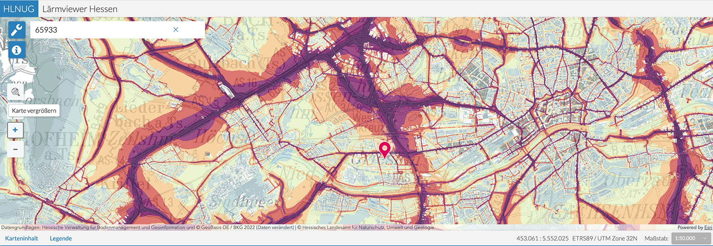

## Links zu Landkarten und Stadtplänen

[https://geoportal.frankfurt.de/karte](https://geoportal.frankfurt.de/karte/?layerIds=55037,55033,55035,118,164&visibility=true,true,true,true,true&transparency=0,0,0,0,0&Map/center=%5b477717.9174093047,5551124.411737716%5d&Map/zoomLevel=14#){:target="_blank"}

Geben Sie als Suchbegriff oben rechts z. B. &quot;Europabrücke&quot; ein! Dann gelangen Sie auf den Teil der A5, der die betroffenen Flurstücke zeigt, wenn Sie nach Süden und Norden scrollen.

## Der Lärmviewer des HNLUG

[ https://laerm.hessen.de/mapapps/resources/apps/laerm/index.html?lang=de](https://laerm.hessen.de/mapapps/resources/apps/laerm/index.html?lang=de){:target="_blank"}

Geben Sie im Suchfeld oben links Ihre Adresse, den Ort oder die betreffende Postleitzahl ein!
